### ¿Qué es Arduino?

### un ordenador, 
### mejor un microordenador, 
### mejor todavía ... es un microcontrolador

## El rey de los microcontroladores: ARDUINO

### No es el mejor, 
### no es el más barato, 
### ni el más rápido, 
### ni el más fácil de usar

## Ha permitido que millones de personas consigan hacer lo que antes sólo hacían los ingenieros

### Arduino es:
* Una placa
* Un entorno de programación, con sus librerías y ejemplos
* Una documentación

## TODO Open Source

### Se creó en [2005](https://es.wikipedia.org/wiki/Arduino) 
### Desde entonces no ha parado de 
* evolucionar, 
* mejorar, 
* crear derivados 
* abaratarse 
* y dar lugar a una industria enorme

Arduino es un microcontrolador (microordenador que controla cosas) de diseño abierto y fácilmente programable

#### Así lo vemos nosotros

#### Así es internamente

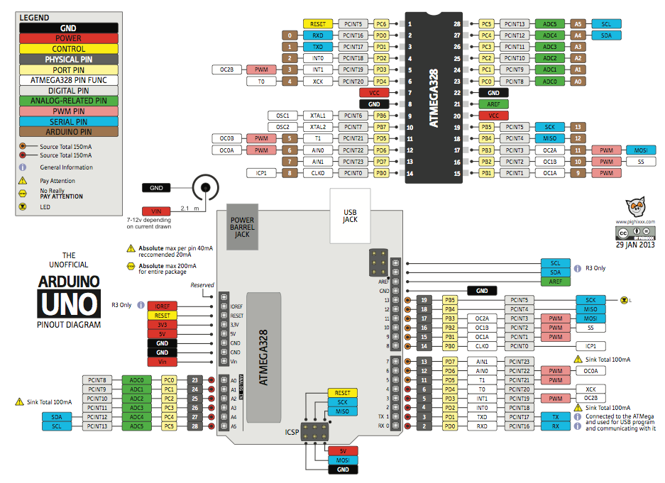

[Más detalle](./imagenes/ArduinoUno_R3_Front.jpg)

## [Aún más detalle](./presentaciones/%200.0%20-%20Introducci%C3%B3n%20a%20Arduino.pdf)

### ¿Para qué sirve?

#### Nos permite desarrollar proyectos donde se necesitan usar sensores, medir, tomar decisiones y controlar actuadores

# Para hacer un proyecto necesitamos:

### Un **programa**

#### ¿Qué es un programa? un conjunto de instrucciones ordenadas

	Por ejemplo para hacer un parpadeo

		Programa parpadeo (blink)
		Encendemos
		Esperamos
		Apagamos
		Esperamos
		Volvemos al principio

### Montaje ([electrónica](./presentaciones/4.0%20-%20Introducci%C3%B3n%20a%20la%20electr%C3%B3nica.pdf))

### Herramientas de programación: [ArduinoBlocks.com](http://www.arduinoblocks.com)

### Parpadeando el led interno

ArduinoBlocks es un entorno de programación visual por bloques que nos permite programar nuestra placa arduino o compatible de forma sencilla, evitando la complejidad de las sentencias C++

Además nos permite programar nuestro arduino sin instalar (practicamente) nada en nuestro ordenador

Empezaremos seleccionando el tipo de placa Arduino que vamos a usar y a continuación añadiremos el hardware que usemos conectándolo a las patillas correspondientes.

[Programa](http://www.arduinoblocks.com/web/project/174285)

#### Ejercicio: Cambiar la velocidad de parpadeo

* * *

## Con led externo

### Montaje con placa prototipo

#### Ejercicio: Cambiar el pin utilizado al pin 7

#### Regulando la velocidad de parpadeo

#### Regulando el brillo

* * *

### Esquema eléctrico

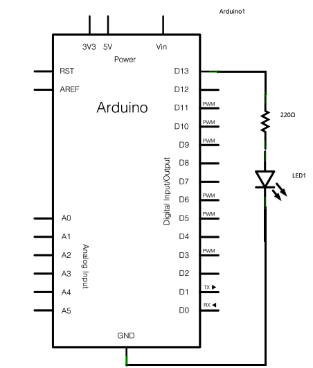

* * *

## Con un relé usaremos ¡¡grandes corrientes eléctricas!!

# Envío de datos serie

### La comunicación serie se produce via USB entre Arduino y el PC

* Detectamos el puerto
* Configuramos la velocidad
* Necesitamos un programa para ver los datos

## Vamos a enviar "On" y "Off" al PC

[Programa](http://www.arduinoblocks.com/web/project/174290)

Ahora deberíamos seguir con semáforos, kit, (cylon) y esas cosas....

### Utilizando sensores sencillos

Podemos utilizar los componentes disponibles con conexión sencilla

#### DTH11: sensor de temperatura y humedad

##### Ahora enviamos "Textos" y **Valores**

[Programa](http://www.arduinoblocks.com/web/project/174286)

### Midiendo, calculando, controlando 

#### En función de la temperatura vamos a decidir si activar el elemento calefactor

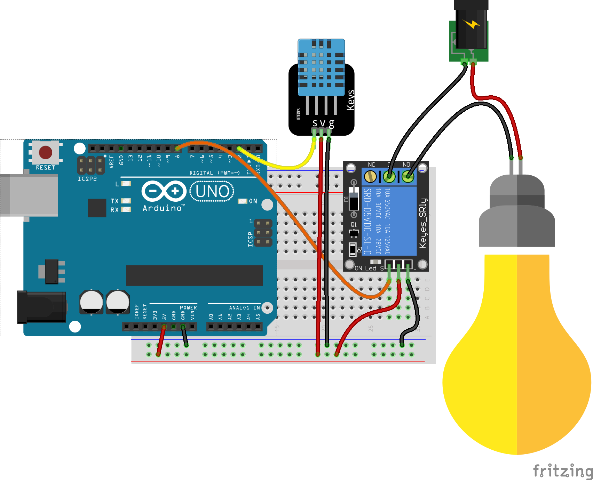

[Programa](http://www.arduinoblocks.com/web/project/174301)

### Igual podíamos hacer con un sensor de líquidos y más preciso como es el ds18b20

[Programa](http://www.arduinoblocks.com/web/project/174308)

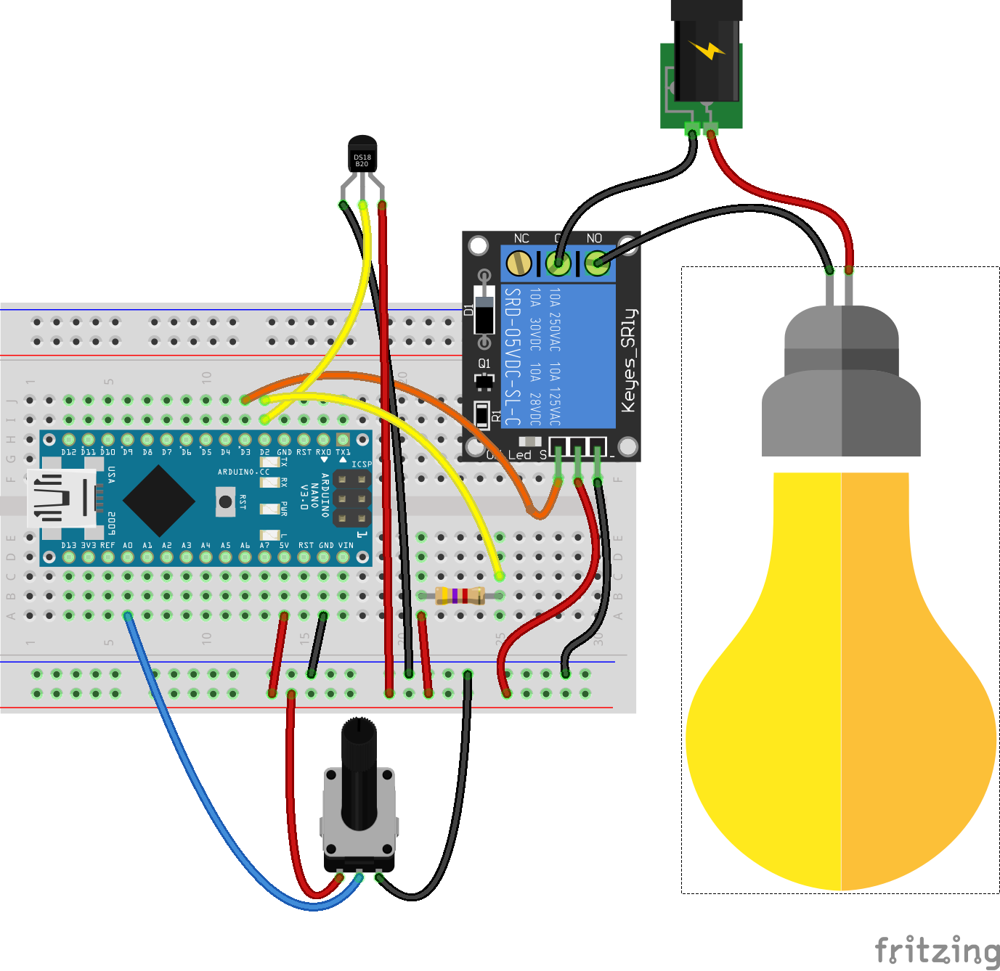

# ¿Cómo es que podemos usar esos sensores? : Librerías: conjunto de código empaquetado

Ejemplo: [lcd](http://arduino.cc/en/pmwiki.php?n=Reference/LiquidCrystal) o [servo](http://arduino.cc/en/pmwiki.php?n=Reference/Servo)

### Para incluir una librería en código hacemos

	#include <Libreria.h>

# Lectura de datos analógicos

## Potenciómetro: resistencia variable (mando de volumen)

### Se leen valores enteros entre 0 y 1023
### Equivalen a los valores de 0V y 5V

Vamos a utilizar nuestro potenciómetro para seleccionar la temperatura objetivo

En muchas ocasiones necesitamos hacer la transformación al rango que a nosotros nos interesa. Para simplificarlo usamos las funciones matemáticas **map**

Convertiremos (mapearemos) la medida de entre 0 y 100 a una temperatura entre 15 y 30º 

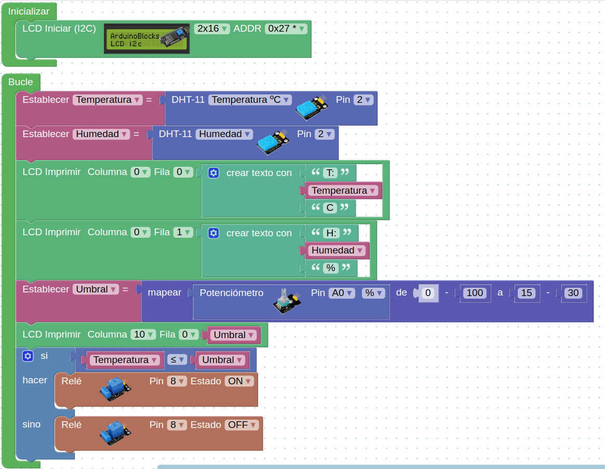

[Programa](http://www.arduinoblocks.com/web/project/174382)
[Programa v2](http://www.arduinoblocks.com/web/project/192734)

* * *
# Números decimales

Usaremos el tipo de variable float

### Ejemplo: Voltímetro
* Leemos el valor de un potenciómetro conectado a una entrada analógica (A0)
* Convertimos el valor (0-1023) a 0 - 5.0v
* Sacamos el valor por la consola serie

* Calibramos viendo los extremos y el valor intermedio 3.3V

	const int analogInPin = A0;  // Entrada analógica
	int sensorValue = 0;        // valor leído

	void setup() {
	  Serial.begin(9600);
	}
	void loop() {

	  sensorValue = analogRead(analogInPin);   // leemos el valor analógico
	  float voltios=(5.0*sensorValue) /1023;   // Lo convertimos
	  Serial.print("sensor = " );                       
	  Serial.print(sensorValue);    
	  Serial.print(" = ");
	  Serial.print(voltios);
	  Serial.println("v");   
	   delay(200);                     
	}

* * *

# Pulsaciones: botones

## Montaje

## Programa

### Usamos una sentencia condicional: si se cumple esto...se hace aquello
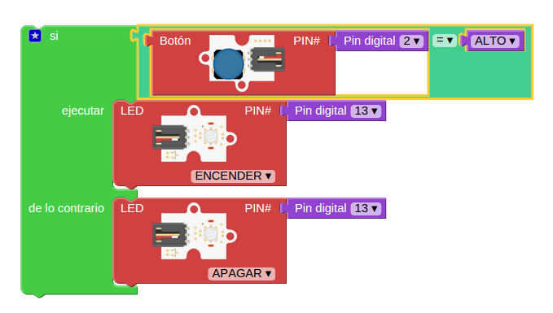

### Su código

	void setup()
	{
	  pinMode(2,INPUT_PULLUP);  // Usamos 2 como entrada
	  pinMode(13,OUTPUT);		// Usamos 13 como salida
	}

	void loop()
	{
	  if (digitalRead(2) == HIGH)  	// Si el pulsador está pulsado
	  {
	    digitalWrite(13,HIGH);		//Encendemos el led 13
	  }
	  else 							// Si NO se cumple
	  {		
	    digitalWrite(13,LOW);		// Lo apagamos
	  }
	}

# Funciones

Cuando tenemos un conjunto de instrucciones que se repiten a lo largo del código podemos hacer nuestro programa más simple creando una **Función**

## Función:

Conjunto de instrucciones que empaquetamos en un bloque y que podemos llamar desde cualquier parte de nuestro código.

* Todas las funciones tienen 1 nombre que con el que se definen

* Una función puede devolver un valor a quien la llama o no

* A una función le podemos pasar un argumento, una variable que usará nuestra función para realizar su cometido

Podemos llamar a una función desde cualquier parte de nuestro código.

* * *
# Escritura de valores analógicos

## Usando técnicas como PWM podemos simular valores intermedios: 0 - 255
### (sólo en algunos pines ~ )

## Como vamos a hacer que cambie de valor usaremos una variable

### Si vemos el código

	void setup()						// configuracion
	{
	  pinMode(11,OUTPUT);				// Usaremos la patilla 11 como salida

	}

	void loop()
	{
	  int contador=0;				// la variable valorSalida empieza en 0
	  while (contador <= 255) {		// Haremos el bucle hasta que lleguemos a 256
	    analogWrite(11,contador);		// pasamos el valor a la patilla 11
	    delay(100);						// Esperamos 0,1 segundos
	   }

	}

## Vamos a hacer ahora una subida y luego la bajada

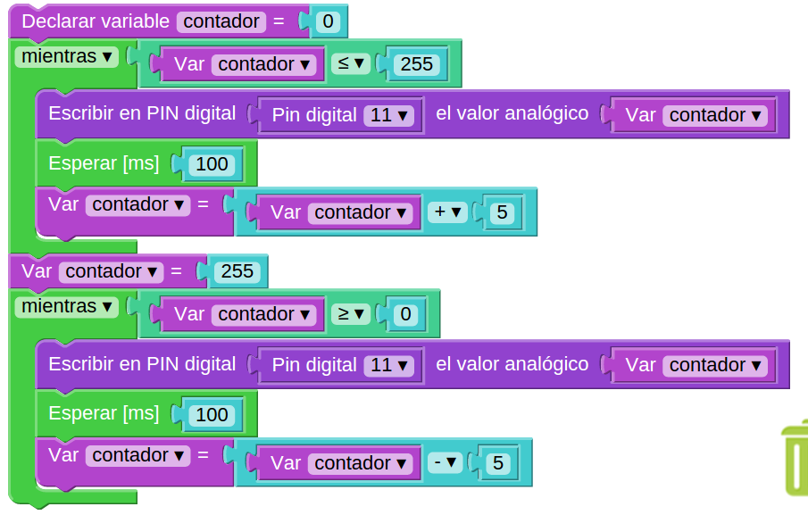

Es importante el dar un valor válido a la variable contador hasta de empezar a bajar

Ejercicio:Añade una línea para que veas el valor desde el PC.

Piensa en qué cambia si lo pones antes o después del incremento de la variable

* * *
# Led RGB
## 3 leds (Red,Green,Blue) con una de las patillas común

## Positivo (Ánodo) Común

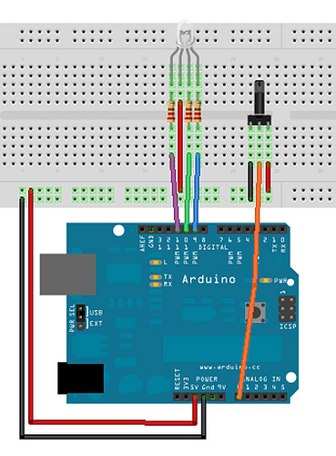

## Negativo (Cátodo) Común

## Tiras de leds: Necesitamos más potencia por lo que usaremos un transistor como amplificador.

### El montaje es sencillo

[Introducción a la electrónica](http://www.slideshare.net/javacasm/40-introduccin-a-la-electrnica)

Un simple transistor Mosfet nos permite controlar grandes potencias

TODO!!!

#### Ejercicios: Combinando colores

Vamos a hacer combinaciones de colores.
Definiremos funciones con distintos colores y haremos una secuencia de colores. Cada función llamar
Es muy importante que seamos claros con los nombres de las variables para así no equivocarnos

* * *
# Potenciómetro regulando una salida analógica

### El código:

	void setup()
	{
	  pinMode(5,OUTPUT);
	}

	void loop()
	{
	  int valorPotenciometro=analogRead(0);				 	// Leemos el valor
	  int ValorSalida=map(valorPotenciometro,0,1023,0,255);	// Convertimos al rango de salida
	  analogWrite(5,ValorSalida);							// Escribimos el valor en la salida
	}

### Ejercicio: usar 3 potenciómetros para controlar los colores de un led RGB

El montaje sería:

Y el programa

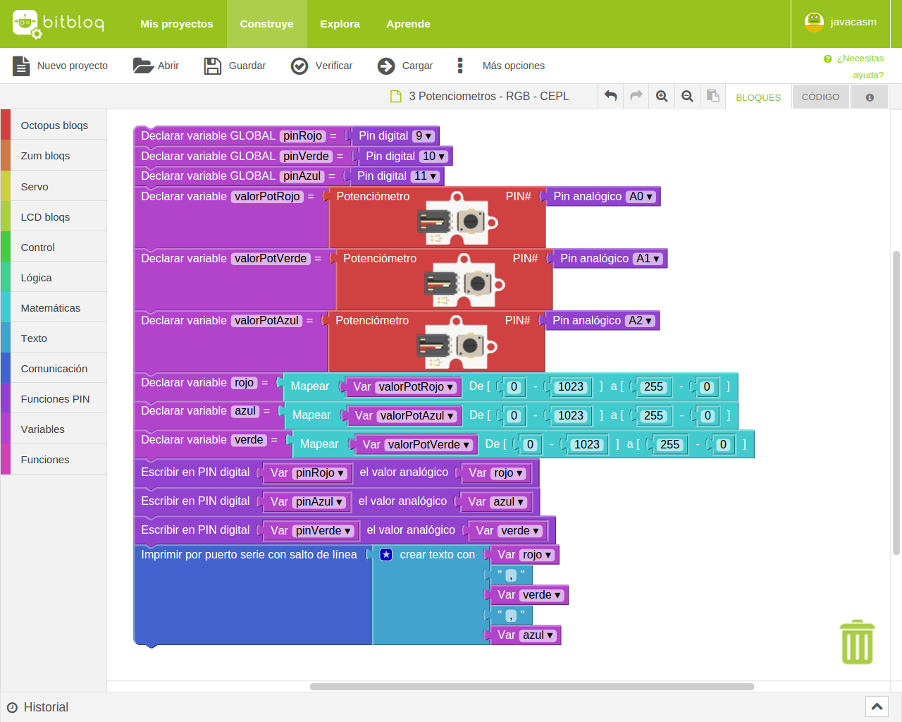

# Motores

Para controlar motores vamos a usar una placa especializada en ello. En concreto usaremos una [placa estándar basada en el chip L298](http://www.dfrobot.com/wiki/index.php?title=Arduino_Motor_Shield_(L298N)_(SKU:DRI0009))

Esta placa es capaz de controlar 2 motores.

Comentar el tema de alimentación y la forma de controlarlo ** Alimentación **

Esta placa, de tipo shield, se conecta encima de arduino y usa unos pines concretos:

|Entrada|pin|Utilidad|
|---|---|---|
|M1|4| Sentido de giro del motor 1|
|E1|5| Velocidad de giro del motor 1|
|E2|6| Velocidad de giro del motor 2|
|M2|7| Sentido de giro del motor 2|

## Programa

Hacemos el siguiente programa bitbloq

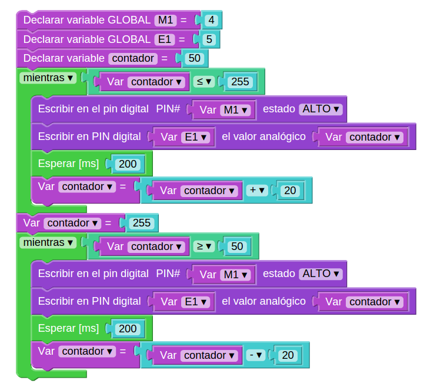

## Código

	//Arduino PWM Speed Control：
	int E1 = 5;  
	int M1 = 4;
	int E2 = 6;                      
	int M2 = 7;                        

	void setup()
	{
	    pinMode(M1, OUTPUT);   
	    pinMode(M2, OUTPUT);
	}

	void loop()
	{
	  int value;
	  for(value = 0 ; value <= 255; value+=5)
	  {
	    digitalWrite(M1,HIGH);   
	    digitalWrite(M2, HIGH);       
	    analogWrite(E1, value);   //PWM Speed Control
	    analogWrite(E2, value);   //PWM Speed Control
	    delay(30);
	  }  
	}

## Control de velocidad del motor

Vamos a controlar la velocidad y el sentido de giro con motores

(En el esquema no se ha puesto la placa L298 y se ha conectado directamente el motor a los pines de control 4 y 5)

Una versión más complicada donde añadimos unos indicadores de la dirección

El programa sería

* * *
# Sensores

## Para los sensores tenemos que seguir los pasos

* Haremos la lectura
* Conversiones: traducimos a valores físicos (aritmética/mapeo) según el fabricante
* Calibraciones: establecemos valores de referencia

[Introducción a la electrónica](http://www.slideshare.net/javacasm/40-introduccin-a-la-electrnica)

[Sensores](http://www.slideshare.net/javacasm/46-sensores)

# Medidas con sensores

Podemos pensar en los sensores como un circuito externo que tenemos que alimentar conectando a 5v y GND (divisor de tensión)

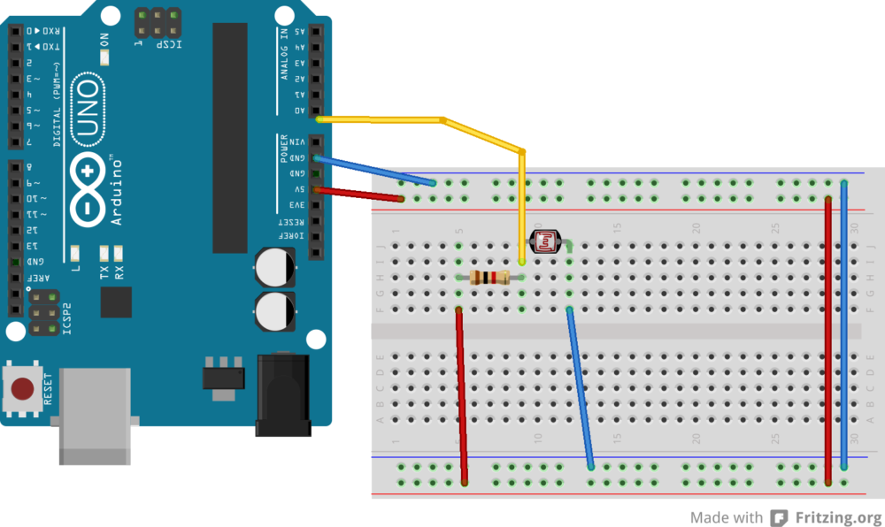

Estudiar el comportamiento con la luz

***

<!-- background: #184bc6-->
<!-- color: #fff -->
<!-- font: centurygothic -->
# LDR (célula fotoeléctrica)

Ejemplo: activaremos un led al pasar de determinado nivel de luz

## Activación de led por umbral de luz

## Regular el nivel con un potenciometro.  Documentarlo.

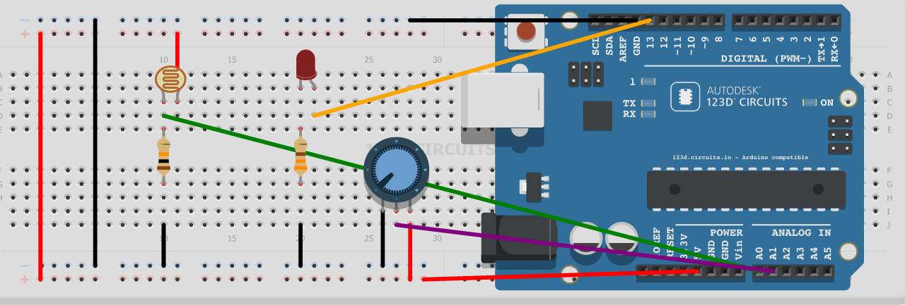

## Seguidor solar

Vamos a añadir ahora un segundo LDR. Esto nos permitirá simular un seguidor solar: compararemos los valores de los dos LDR, moviendo el servo en la dirección del que más luz recibe

El programa sería este:

***

<!-- background: #184bc6-->
<!-- color: #fff -->
<!-- font: centurygothic -->
# Termistor (sensor de temperatura)
[Documentación del kit](http://www.seeedstudio.com/wiki/Sidekick_Basic_Kit_for_Arduino_V2#Thermistors)  

[foros](http://www.seeedstudio.com/forum/viewtopic.php?f=16&t=2117&p=14846&hilit=thermistor#p14846)  

[fabricante](http://www.seeedstudio.com/forum/download/file.php?id=1345)

[Ejemplo 1](http://playground.arduino.cc/ComponentLib/Thermistor)

[Ejemplo 2](http://playground.arduino.cc/ComponentLib/Thermistor2)

* * *
# Sensor de temperatura LM35: viene calibrado y linealizado

## Usamos la fórmula del fabricante

	temperatura = valorAnalogico*5*100/1024

[pinout lm35](./imagenes/tmp36pinout.gif)

* * *
## El código quedaría así:

### Enviaremos el dato leído al pc con la función __Serial__

	int sensorPin=A0;

	void setup()
	{
		Serial.begin(9600);  // Configuramos la conexión
	}

	void loop()
	{
		int sensorValue= analogRead(sensorPin);  // Leemos el valor analógico
		float temperatura=(sensorValue*5*100)/1024; // float para tener decimales
		Serial.println(temperatura);			// Enviamos el dato al PC
		delay(1000);
	}

* * *

* * *
# Servo

### Los servos son motores capaces de mantener una posición angular.
### Se les dice él ángulo que deben formar

##### (también hay servos que pueden girar todo lo que quieran)

* * *

### El código

	#include <Servo.h>  // Incluimos la librería

	Servo servo;       // Declaramos que vamos a usar 1 servo

	void setup()
	{
	  servo.attach(7); // Configuramos el servo conectado al pin 7
	}

	void loop()
	{
	  int valorPotenciometro=analogRead(A0); 					// Leemos el potenciometro
	  int PosicionServo=map(valorPotenciometro,0,1023,0,180);	// Reescalamos el valor
	  servo.write(valorPotenciometro);							// Le pedimos que gira hasta ese ángulo
	  delay(50);												// Le damos tiempo para que complete el giro

}
## Oscilación servo

Podemos utilizar un bucle para hacer que el servo oscile entre las posiciones extremas

#### [Más sobre servos](http://www.slideshare.net/javacasm/arduino-prctico-servos)

* * *

# LCD

### Existen varias librerías:

* [Librería LCD MF](https://bitbucket.org/fmalpartida/new-liquidcrystal/wiki/Home)
* [Ejemplos lcd](http://arduino-info.wikispaces.com/LCD-Blue-I2C#v3)
* [Ejemplo bq](http://diwo.bq.com/programando-lcd/)

### Usaremos lcd I2C

* Descargamos de su [origen](http://www.4tronix.co.uk/arduino/sketches/LiquidCrystal_V1.2.1.zip)
* Descomprimimos en la carpeta **arduino/libraries**

### Montaje

### Código

	#include <Wire.h>
	#include <LiquidCrystal.h>

	LiquidCrystal lcd(0x27);  // El fabricante nos debe decir la dirección

	void setup()
	{
	  lcd.begin(16, 2);  //Geometria del lcd
	  lcd.clear();

	}

	void loop()
	{
	  lcd.setCursor(0,0);  		// Nos movemos a la posición
	  lcd.print("Hola Mundo");	// Mostramos un texto

	}

* * *
# Proyecto: termostato configurable y que activa un relé

[Proyecto 1](https://arduinolab.wordpress.com/)

[Proyecto 2](http://www.electroschematics.com/8998/arduino-temperature-controlled-relay/)
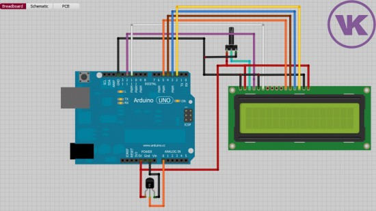

## Veamos los componentes:

* Sensor lm35 conectado a A0
* Potenciómetro conectado a A1
* Relé conectado a D7
* LCD conectado a A4 y A5

## Programa

Comparamos el valor leido del potenciómetro con el leído del potenciómetro.
Si este es máyor activamos el relé
Mostramos en el lcd la temperatura actual

## Publicación de datos
Existen placas con conectividad Wifi como el NodeMCU, ESP8266, ESP12, ESP32

Podemos enviar los datos a servidores de internet

Podemos usar MQTT, ThingSpeak, Blynk

* * *
### ¿Dónde comprar?

Ante todo hay que mirar lo que se compra y la documentación e información que se incluye.

# Españolas

[Electan](http://www.electan.com/)

[Cooking Hacks](http://www.cooking-hacks.com/)

[Bricogeek](http://tienda.bricogeek.com/)

[Bq](http://www.bq.com/es/productos/kit-robotica.html)

***

# Internacionales

[Sparkfun](https://www.sparkfun.com/)

[Adafruit](http://www.adafruit.com/)

[SeedStudio](http://www.seeedstudio.com)

# Internacionales baratas

[Elecfreaks](http://www.elecfreaks.com/)

[EletroDragon](http://www.electrodragon.com/)

# Baratas (bazares)

[DX](http://www.dx.com/s/arduino)

* * *

# Agradecimientos:

[Arduino](http://arduino.cc)

[Adafruit](http://adafruit.com)

[Sparkfun](http://sparkfun.com)

[wikipedia](http://es.wikipedia.org)

[José Pujol](https://tecnopujol.wordpress.com)
### Generando datos
### Publicando datos

## Recursos

[Arduino desde cero con ArduinoBlocks](https://didactronica.com/itinerario/)    w
