# Arduino Básico

## Curso para el CEP de Cordoba

19, 20, 25 y 26 de Abril y 9 de Junio 2016

## Nivel básico

José Antonio Vacas @javacasm

[https://github.com/javacasm/ArduinoBasicoCEPCordoba](https://github.com/javacasm/ArduinoBasicoCEPCordoba)

([Enlace al moodle del curso](http://educacionadistancia.juntadeandalucia.es/profesorado/course/view.php?id=2418))

# Recursos: ¿dónde obtener ejemplos?

[Procomún educalab](http://procomun.educalab.es/es/ode/view/1453974406581)

[Proyectos bitbloq](http://bitbloq.bq.com/#/explore)

[Curso bitbloq](http://diwo.bq.com/course/aprende-robotica-y-programacion-con-bitbloq-2/)

[Otros Proyectos](https://github.com/javacasm/ProyectosEscolaresRobots/blob/master/proyectos/proyectos.md)

# web de proyectos

[Hackster](https://www.hackster.io/)

[HackADay](http://hackaday.com/)

[Instructables](http://www.instructables.com/)

[MakeZine](http://makezine.com/)

[Foros Spainlabs](http://spainlabs.com/foros/)

# Parpadeando

1. Empezamos con 1 led Parpadeando

1. Ahora vamos hacer que parpadean 2 Leds

1. Controlemos ahora la Velocidad de parpadeo usando un potenciómuestreo

Usaremos este Hardware

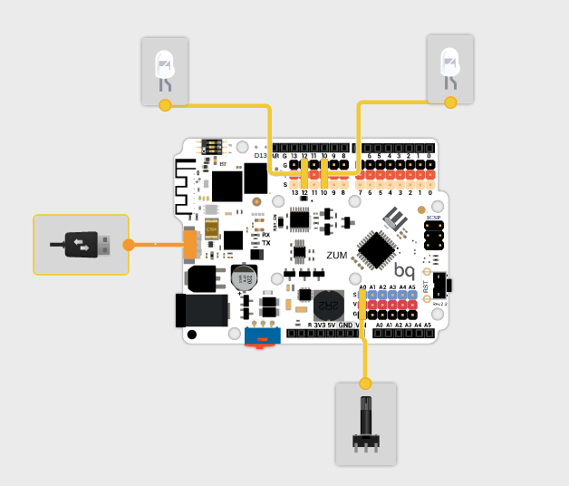

y este Programa

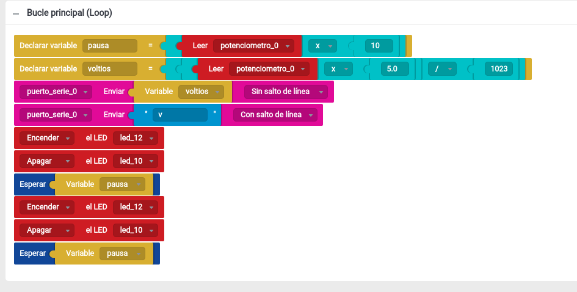

donde:

1. Encendemos en alternancia
1. Leemos el valor de un potenciómetro
1. Hemos declarado unas variables para reusar el valor y no tener que leer varias veces
1. Calculamos el voltaje que tendrá el pin A0 con la fórmula

v=lectura*5.0/1023

(hay que recordar la importancia de hacer el cálculo con número decimales)
1. Enviamos datos al PC

# Voltímetro

Vamos a añadir al ejemplo anterior la medida de voltaje.

1. Calculamos el voltaje que tendrá el pin A0 con la fórmula

v=lectura*5.0/1023

(hay que recordar la importancia de hacer el cálculo con número decimales)
1. Enviamos datos al PC

# Termostato

Vamos a simular un termostato con un potenciómetro.

1. Leeremos un valor analógico, que simulará una temperatura.
1. En función del valor leído, activaremos una salida, que simula el sistema de frío u otra que simulará el sistema de calor. Si quisieramos hacer el sistema realmente, bastaría conectar un relé a cada salida.

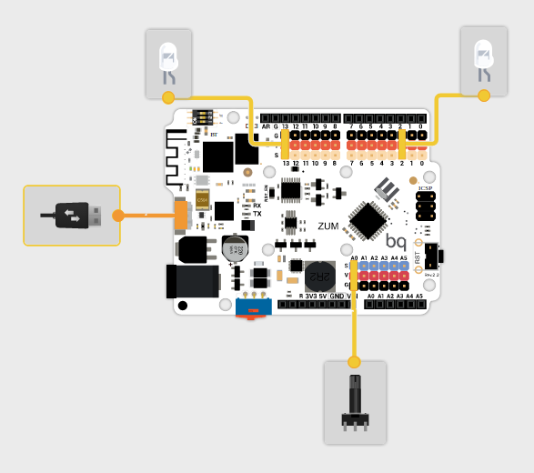

## Programa

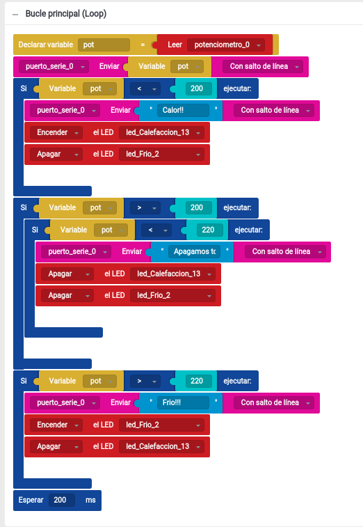

Coneptos:
* Umbral.
* Histéresis: importancia de dejar unos márgenes de tolerancia.
* Funciones condicionales simples y complejas.

# Luz de escalera con duración regulable

## Hardware

Un pulsador activa la luz de la escalera, cuya duración depende del valor de un potenciómetro

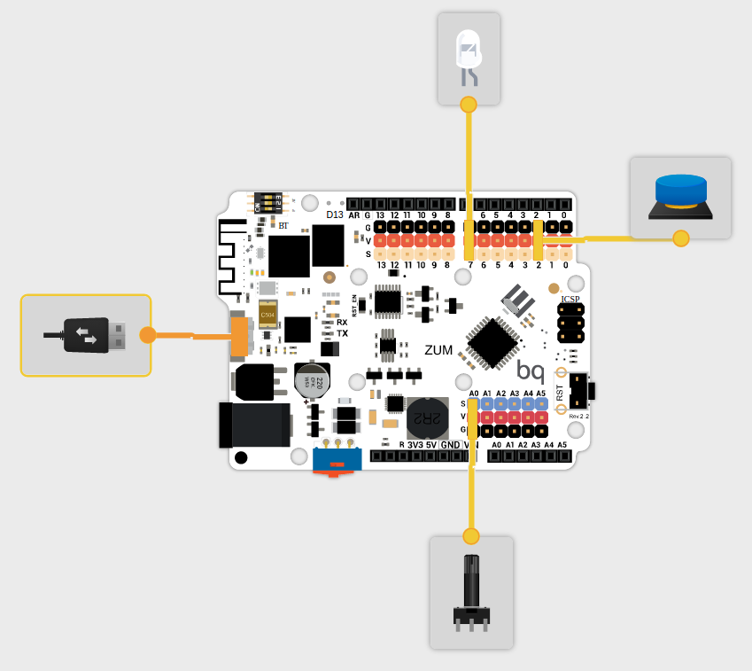

## [Enlace al Proyecto](http://bitbloq.bq.com/#/bloqsproject/546e2764e4b0bde006d0857e:f38326dd-180b-4f46-8963-3cbd35d909a1)

## Programa

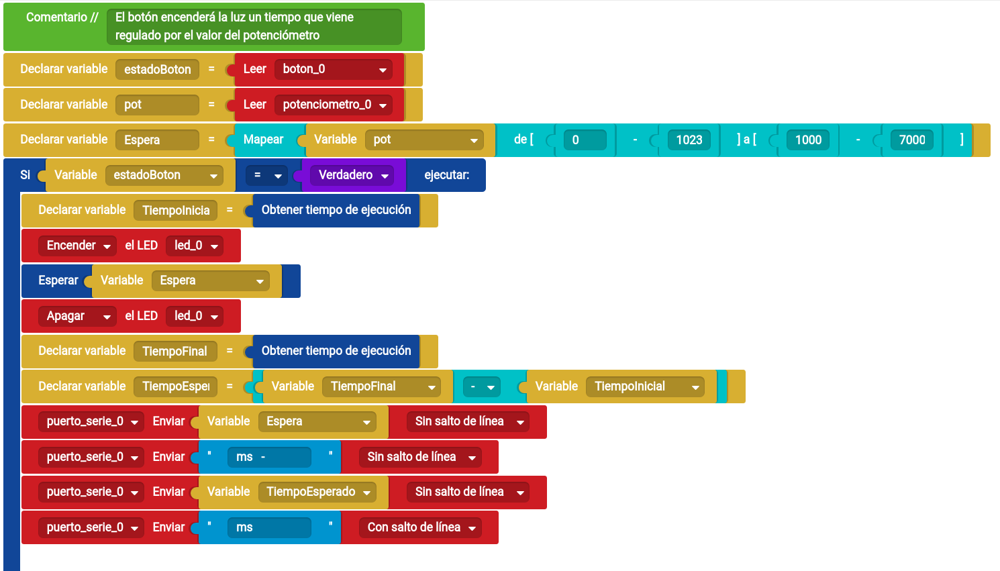

# Robot No te caigas

Robot muy sencillo que va vigilando por si encuentra el borde de la mesa, deteniéndose si lo encuentra.

## Hardware

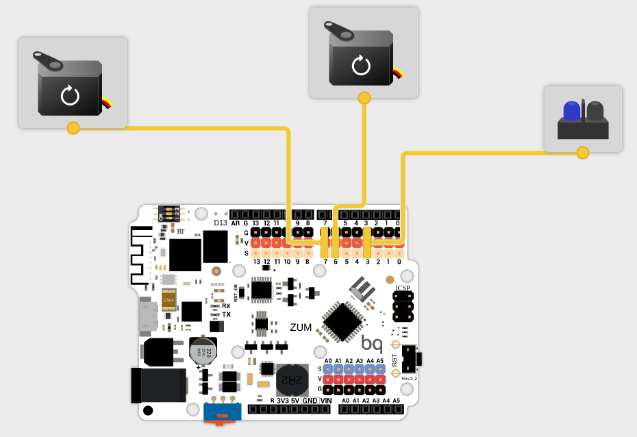

## Programa

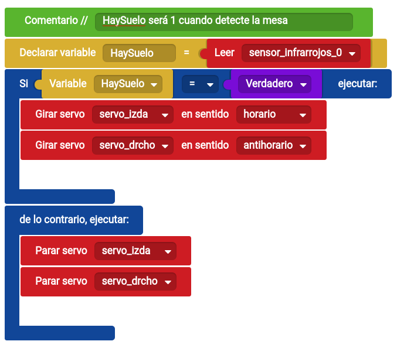

## [Enlace al Proyecto](http://bitbloq.bq.com/#/bloqsproject/546e2764e4b0bde006d0857e:4c95e7b5-0717-4881-8593-8963f37550aa)

# Semáforo

## Pasos

1. Empezamos por un semáforo con 2 luces (usaremos verde y azul)

1. Añadimos un servo para bloquear el paso (podemos hacer una maqueta)
  * Concepto de librería
  * Control de servo
[Proyecto](http://goo.gl/jkFhcs)

### Hardware

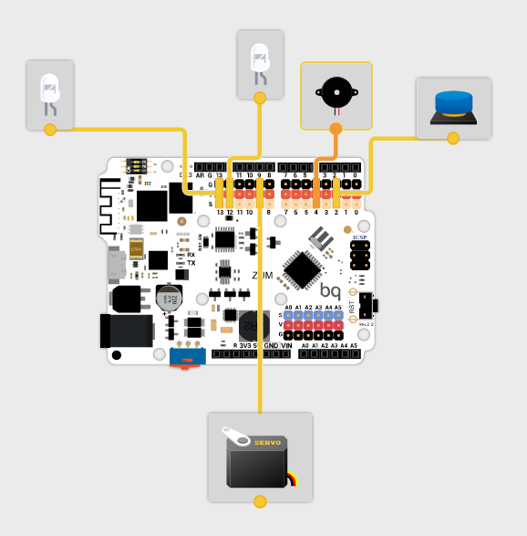

1. Queremos añadir un botón para decidir cuando cambia. Basta con activar el cambio cuando se activa el pulsador

1. Ahora vamos a añadir un sensor de paso que lanzará una alarma cuando se active. Vemos que la espera nos complica todo...
  * Debemos de romper la espera larga en esperas más pequeñas
  * Usaremos un bucle de repetición determinista: for

TODO: Maqueta (¿modelo 3D?)

# Seguidor solar

1. ¿qué es un Seguidor Solar?

1. Componentes
  * Montaje
  * LDR (concepto de sensores)
  * Leds como indicadores
  * Servo como indicador

1. Programa
  * Conceptos:
    * Calibración
    * Offset
    * Velocidad de muestreo

TODO: Maqueta (¿modelo 3D?)

# Gaita electrónica

Se trata de usar dos sensores analógicos para controlar la frecuencia y la duración de la nota que reproducirá el zumbador

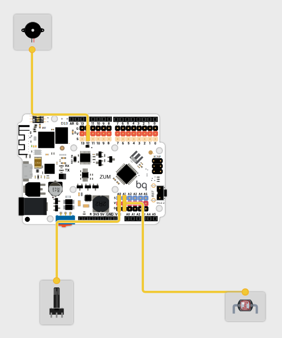

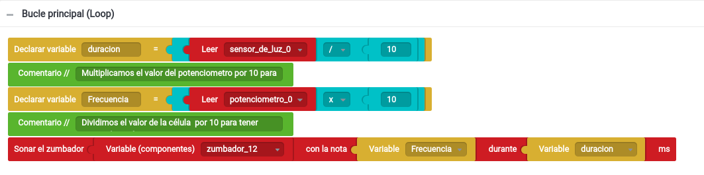

Propuesta: usar sensores digitales (sensores infrarrojos) para construir un instrumento afinado

# Sensor de aparcamiento

Vamos a utilizar el Sensor de ultrasonidos para medir la distancia hasta un obstáculo.

En primer lugar probaremos que este hace medidas más o menos precisas usando el envío del valor medido al PC.

En función de la distancia al obstáculo haremos:
* Si es menor que 100cm encenderemos el led de primer aviso
* Si es menor que 50cm encenderemos el led del 2º aviso.
* Si es menor que 30cm comenzaremos a emitir un sonido más rápido cuando más cerca esté el obstáculo.

[Enlace al proyecto](http://bitbloq.bq.com/#/bloqsproject/546e2764e4b0bde006d0857e:181600d4-5f14-4bd8-a156-b9a304476891)

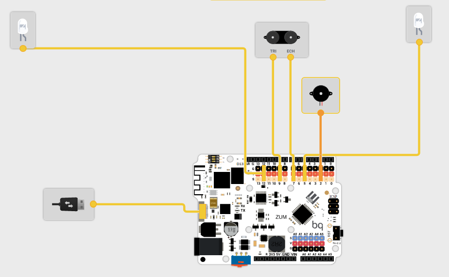

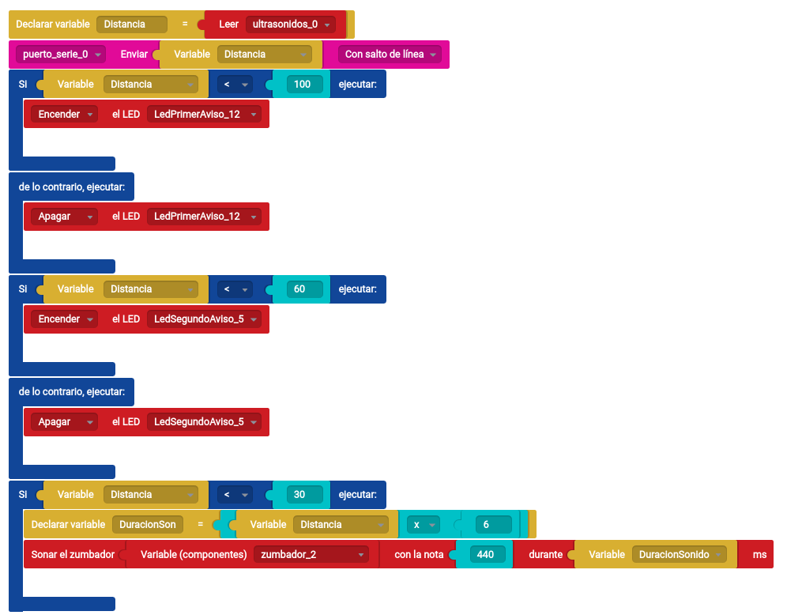

[vídeo](https://www.youtube.com/watch?v=7hgUJK6-60k&feature=youtu.be)

# Robot siguelíneas

Se trata de un robot sencillo que usa 2 servos para moverse y que sigue una línea negra sobre fondo blanco.

[Enlace al proyecto](http://bitbloq.bq.com/#/bloqsproject/546e2764e4b0bde006d0857e:6f5e9d66-9811-4ce6-b9bf-c3b1a9244fec)

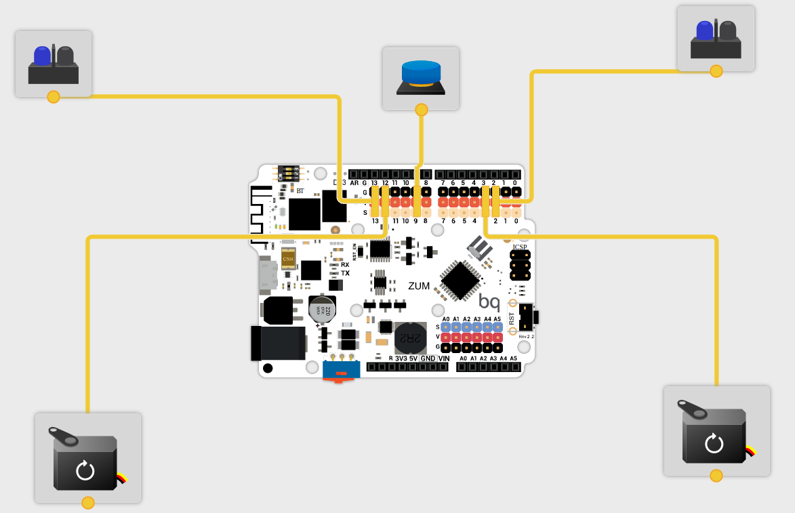  

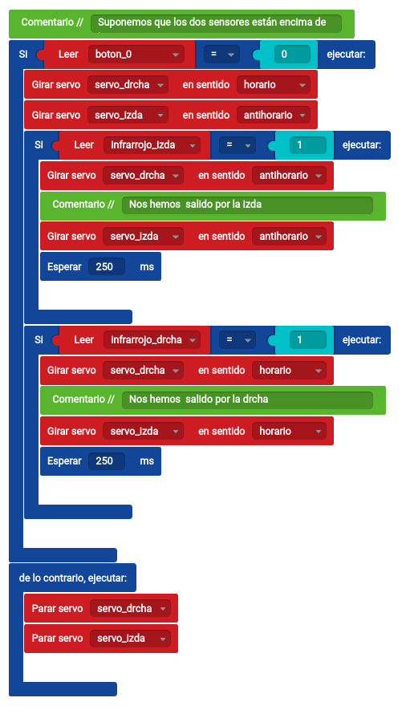
