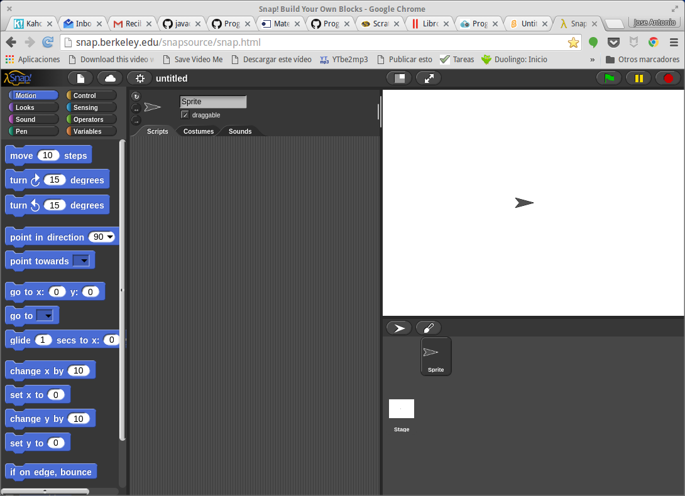

# Scratch, aprender programando [(191813GE031)](https://www.juntadeandalucia.es/educacion/secretariavirtual/consultaCEP/actividad/191813GE031/) 

## CEP Guadix

### José Antonio Vacas @javacasm

## https://github.com/javacasm/ScratchGuadix

* * * 

# [Snap](http://snap.berkeley.edu/)

* Es una alternativa a [Scratch](./Scratch.md)
* Los bloques son prácticamente idénticos
* Usa 100% open source (basado en javascript y HTML)
* Podemos descargar el código y usarlo offline

